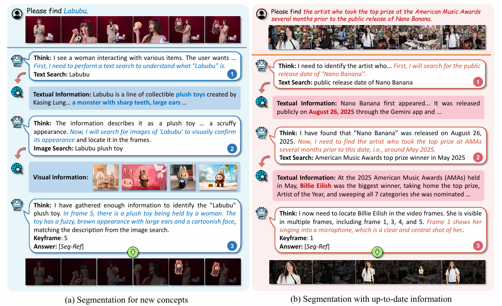
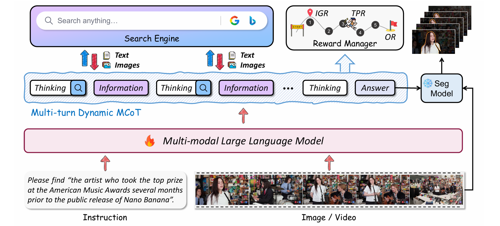

<div align="center">

<h3>Seg-ReSearch: Segmentation with Interleaved Reasoning and External Search</h3>

[](https://arxiv.org/abs/2602.04454)
[](LICENSE)

[Tianming Liang](https://tmliang.github.io/)  &emsp;
Qirui Du  &emsp;
[Jian-Fang Hu](https://isee-ai.cn/~hujianfang/)  &emsp;
Haichao Jiang  &emsp;
Zicheng Lin  &emsp;
[Wei-Shi Zheng](https://www.isee-ai.cn/~zhwshi/)

ISEE Lab, Sun Yat-sen University


</div>

## 🌟 Highlights

Through multi-turn interleaved reasoning and web search, **Seg-ReSearch** is able to localize and segment any text-guided target in images or videos, even those involving new concepts or up-to-date information that lies beyond the internal knowledge of MLLMs.

## 📢 News
* **[2026/02/06]** All training and inference code for Seg-ReSearch has been released. Check it out!
* **[2026/02/06]** We have released [**OK-VOS**](https://huggingface.co/datasets/iSEE-Laboratory/OK_VOS/tree/main), the first VOS Benchmark explicitly requiring external knowledge.
* **[2026/02/04]** The paper is available on [arXiv](https://arxiv.org/abs/2602.04454).
## 🔎 Framework

**Seg-ReSearch** conducts multi-turn interactions with the search engine throughout the dynamic Multi-modal Chain-of-Thought (MCoT). This capability is incentivized by a hierarchical reward design: **IGR** pilots the initial planning, **TPR** encourages extensive exploration, and **OR** ensures final task accuracy.

## ⚙️ Getting Started
To support Qwen3-VL, we use `verl==0.7.0.dev0` and `vllm==0.11.0`, which require `pytorch>=2.8.0` and `cuda>=12.6`.

### Installation
```bash
git submodule update --init --recursive
conda create --name seg-research python=3.10
conda activate seg-research
pip install -e verl
pip install -e ".[vllm,search_tool]"
pip install "flash-attn==2.8.3" --no-build-isolation
```

### Retrieval Server Setup
We recommend creating a separate environment for the retrieval server to avoid dependency conflicts.
```bash
conda create --name retrieval python=3.10
conda activate retrieval
conda install -c pytorch -c nvidia faiss-gpu=1.8.0
pip install transformers datasets fastapi numpy torch uvicorn
```

## 📦 Data Preparation
### Download OK-VOS Benchmark
```bash
bash data/download_okvos.sh
```

### Preprocess
Run the preprocessing script to prepare the datasets for training and evaluation. This script includes extracting the `bbox` and `point`.
```bash
# Training Set
python examples/data_preprocess/okvos.py --split train --num_frames 6 --max_size 448 --min_size 448 --model_type Qwen3VL

# Test set
python examples/data_preprocess/okvos.py --split test --num_frames 6 --max_size 448 --min_size 448 --model_type Qwen3VL
```


## 🚀 Training
1. Activate the `retrieval` environment and start the retrieval server.
```bash
bash examples/train/okvos/start_retrieval.sh
```

2. Activate the `seg-research` environment and run one of the following scripts.

* **Qwen3-VL-4B-Instruct:**
```bash
# GRPO Training
bash examples/train/okvos/train_4b.sh 

# DAPO Training
bash examples/train/okvos/train_4b_dapo.sh
```

* **Qwen3-VL-8B-Instruct:** 
```bash
# GRPO Training
bash examples/train/okvos/train_8b.sh 

# DAPO Training
bash examples/train/okvos/train_8b_dapo.sh
```
Note: We set `tensor_model_parallel_size=2` for 48G GPU memory. You can reduce it to 1 if you have larger memory.

## 📊 Evaluation

### 1. Reasoning & Search

Remember to replace the checkpoint path in the evaluation script before running.

```bash
# Serper API (Google Search)
bash examples/train/okvos/eval.sh 

# DuckDuckGo (Free API)
bash examples/train/okvos/eval_ddg.sh
```
The prediction results will be saved in a `jsonl` file.

### 2. Segmentation

Based on the generated jsonl file, run the segmentation model to generate object masks:

```bash
python post_segmentation/sam2_okvos.py [path_to_jsonl]
```

## 🤝 Acknowledgements
Our work is built upon [verl-tool](https://github.com/TIGER-AI-Lab/verl-tool), [Seg-Zero](https://github.com/JIA-Lab-research/Seg-Zero) and [SeC](https://github.com/OpenIXCLab/SeC). We sincerely appreciate these excellent works.


## 📜 Citation
If you find our work helpful for your research, please consider citing our paper.
```bibtex
@article{liang2026segresearch,
title={Seg-ReSearch: Segmentation with Interleaved Reasoning and External Search}, 
author={Tianming Liang and Qirui Du and Jian-Fang Hu and Haichao Jiang and Zicheng Lin and Wei-Shi Zheng},
journal={arXiv preprint arXiv:2602.04454},
year={2026}
}
```
